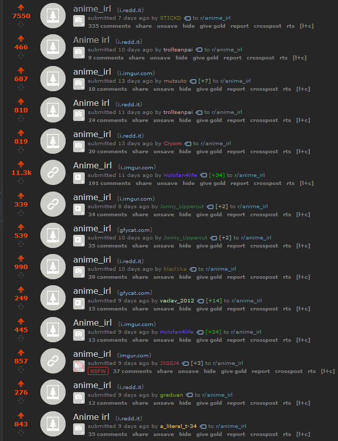
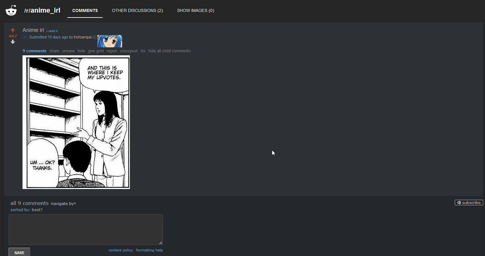

# PTW Extender

| Add-on/Extension Repository/Store |
| --- |
| [Firefox](https://addons.mozilla.org/en-US/firefox/addon/ptw-extender/) |
| [Chrome](https://chrome.google.com/webstore/detail/ptw-extender/cbllkljhggikogmnnfiihcbgenkmjanh)

---

An extension that makes adding titles to one's MyAnimeList's plan-to-watch list easier by automatically taking you to the edit details page for that title when given an appropriate URL where it sets the status as "plan-to-watch" and puts the URL of the tab you were on into the comments box so that you can refer back to why you added it to the list in the first place.  NOTE: You need to already be logged into MAL in order for this extension to work since, as of the writing of this README, there is no way to access and modify a user's data without the add-on storing your MAL credentials, which I do not want to do.

## Why?

My problem is that I'd keep finding gifs or pics or watch-this posts or nostalgia threads or ... of anime and manga that'd make me want to add them to my ptw list; however, I'd either put it on there without putting up a source, which would eventually result in me wondering why that show was on there in the first place, or I would just save the source without going to the bother of adding it to the list.  All in all, this resulted in a mildly frustrating experience when trying to keep track of WHICH title I wanted to consume and WHY I wanted to do so.

Having gotten tired of this, I decided to make an extension that would automate the process sufficiently enough that it'd be easy to go through that process, resulting in sourced anime and manga being added to my plan-to-watch list... where they'll stay and rot forever. 

---

### System dev-dependencies
  * Inkscape - Cmdline tool to convert icon.svg into a set of resized PNG files
  * Node/npm - Javascript package manager
  * Unix-like operating system - The build script at least assumes you got bash

### Build process
Run `build` to install dependencies locally, move over libraries, and generate the icons.
